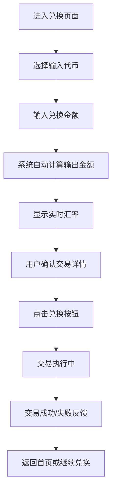
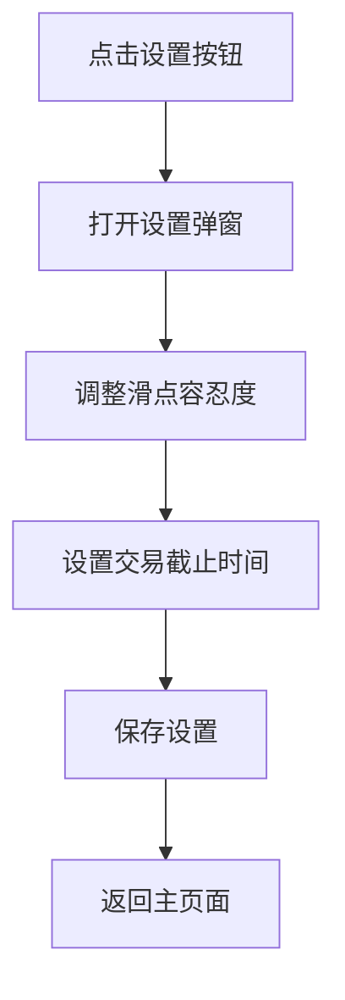

# 兑换页面优化需求文档

## 1. 产品概述

优化现有的兑换页面，提升用户体验和操作效率。通过重新设计界面布局、增强交互反馈、优化信息展示，打造一个专业、直观、高效的数字资产兑换平台。

目标用户：数字资产持有者、DeFi用户、加密货币交易者
核心价值：简化兑换流程，提供实时汇率信息，确保交易安全，提升操作效率

## 2. 核心功能

### 2.1 用户角色

| 角色 | 注册方式 | 核心权限 |
|------|----------|----------|
| 普通用户 | 钱包连接 | 查看汇率、执行兑换、查看交易历史 |
| 高级用户 | 钱包连接 + 交易量要求 | 自定义滑点、高级交易设置、批量兑换 |

### 2.2 功能模块

兑换页面包含以下核心功能模块：

1. **兑换输入区域**：双代币输入框，支持快速金额输入和MAX功能
2. **汇率展示区域**：实时汇率显示，包含价格影响提示
3. **交易详情面板**：滑点、费用、最小接收量等信息
4. **执行操作区域**：主要兑换按钮，状态反馈
5. **安全提示区域**：地址确认、风险提示、交易确认

### 2.3 页面详情

| 页面名称 | 模块名称 | 功能描述 |
|----------|----------|----------|
| 兑换页面 | 头部导航 | 显示页面标题、设置按钮、返回功能 |
| 兑换页面 | 代币输入区域 | 双代币输入框，支持金额输入、代币选择、余额显示 |
| 兑换页面 | 汇率展示 | 实时汇率显示、价格影响提示、刷新功能 |
| 兑换页面 | 交易详情 | 显示滑点、网络费用、最小接收量、路由信息 |
| 兑换页面 | 执行按钮 | 主要兑换操作，包含加载状态和禁用状态 |
| 兑换页面 | 安全提示 | 地址确认、风险提示、交易说明 |
| 兑换页面 | 快速设置 | 滑点设置、交易截止时间设置 |
| 代币选择弹窗 | 代币列表 | 显示可用代币、余额、图标 |
| 设置弹窗 | 交易设置 | 滑点容忍度、交易截止时间配置 |

## 3. 核心流程

### 3.1 标准兑换流程

### 3.2 高级设置流程

## 4. 用户界面设计

### 4.1 设计规范

**色彩方案：**
- 主色调：#6366F1（靛蓝色）- 主要按钮和交互元素
- 辅助色：#7C4DFF（深紫色）- 交换按钮和特殊操作
- 成功色：#10B981（翡翠绿）- 成功状态和正面反馈
- 警告色：#F59E0B（琥珀黄）- 警告和重要提示
- 错误色：#EF4444（红色）- 错误状态和负面反馈
- 中性色：#6B7280（灰色）- 次要文字和边框

**字体规范：**
- 标题：18px，font-weight: 600
- 主要文字：16px，font-weight: 500
- 次要文字：14px，font-weight: 400
- 提示文字：12px，font-weight: 400

**间距规范：**
- 模块间距：24px
- 元素间距：16px
- 内边距：20px
- 小组件间距：8px

### 4.2 组件设计

| 模块名称 | 组件类型 | 设计规范 |
|----------|----------|----------|
| 代币输入框 | 容器组件 | 圆角16px，背景色#F9FAFB，边框1px #E5E7EB |
| 金额输入 | 文本输入 | 字体24px，字体粗细600，右对齐，占位符0.0 |
| 代币选择器 | 按钮组件 | 圆角12px，背景色白色，包含代币图标和链图标 |
| 交换按钮 | 圆形按钮 | 直径40px，背景色#7C4DFF，白色交换图标 |
| 汇率展示 | 信息卡片 | 水平布局，包含汇率文字和刷新图标 |
| 交易详情 | 详情面板 | 圆角12px，背景色#F9FAFB，包含4行详情信息 |
| 执行按钮 | 主按钮 | 全宽按钮，圆角12px，背景色#6366F1，高度48px |
| 安全提示 | 警告卡片 | 圆角12px，背景色#FEF3C7，边框色#F59E0B |

### 4.3 交互状态

**按钮状态：**
- 默认状态：背景色#6366F1，白色文字
- 悬停状态：背景色#4F46E5，轻微阴影
- 禁用状态：背景色#9CA3AF，灰色文字
- 加载状态：显示加载动画，禁用点击

**输入框状态：**
- 默认状态：边框色#E5E7EB
- 焦点状态：边框色#6366F1，显示焦点边框
- 错误状态：边框色#EF4444，显示错误提示

**反馈状态：**
- 成功提示：绿色背景，白色文字，显示2秒
- 错误提示：红色背景，白色文字，显示3秒
- 警告提示：黄色背景，深色文字，显示4秒

### 4.4 响应式设计

**移动端适配：**
- 基础字体大小：14px
- 输入框高度：自适应内容
- 按钮高度：48px（符合移动端触摸标准）
- 间距调整：适当减小模块间距

**平板端适配：**
- 内容区域最大宽度：600px
- 居中显示，左右留白
- 保持桌面端交互体验

**桌面端适配：**
- 内容区域最大宽度：800px
- 支持键盘快捷键操作
- 鼠标悬停效果增强

## 5. 功能优化细节

### 5.1 实时计算优化

- **即时响应**：输入金额时立即计算输出结果
- **防抖处理**：避免频繁计算，设置300ms延迟
- **精度控制**：显示6位小数，避免精度误差
- **边界处理**：处理极小金额和极大金额的情况

### 5.2 用户体验优化

- **快捷操作**：提供25%、50%、75%、MAX快捷按钮
- **历史记录**：记住最近使用的代币对
- **智能推荐**：基于用户持仓推荐最优兑换路径
- **一键反转**：快速交换输入输出代币

### 5.3 安全机制

- **地址验证**：显示完整收款地址，支持复制验证
- **交易确认**：执行前显示交易详情确认弹窗
- **滑点保护**：默认1%滑点保护，防止价格滑点损失
- **网络检测**：自动检测网络状态，防止网络错误

### 5.4 性能优化

- **懒加载**：代币列表按需加载，提升首次加载速度
- **缓存机制**：缓存汇率数据，减少API调用
- **本地计算**：简单计算在本地执行，减少服务器压力
- **错误重试**：网络错误自动重试机制

## 6. 可访问性设计

- **色彩对比**：确保所有文字与背景对比度符合WCAG 2.1标准
- **字体大小**：支持系统字体大小调整
- **屏幕阅读器**：为所有交互元素提供语义化标签
- **键盘导航**：支持Tab键导航和Enter键确认
- **触摸目标**：确保所有可点击区域不小于44x44像素

## 7. 国际化支持

- **多语言**：支持中英文切换
- **货币格式**：根据地区自动调整数字格式
- **时区处理**：交易时间显示本地时区
- **本地化提示**：根据用户地区显示相关提示信息