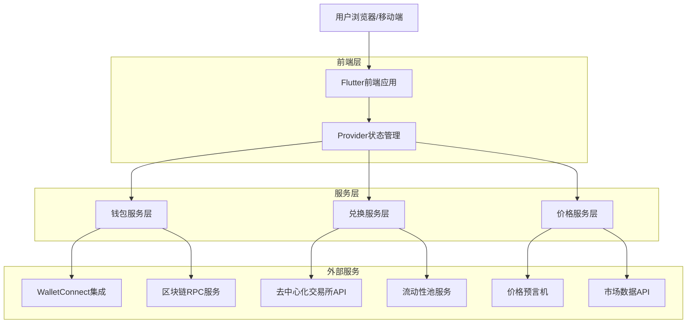

# 兑换页面技术架构文档

## 1. 架构设计



## 2. 技术栈描述

### 前端技术栈

* **框架**: Flutter 3.16+ (跨平台移动应用开发)

* **状态管理**: Provider 6.0+ (轻量级状态管理)

* **UI组件**: Material Design 3 (现代化设计语言)

* **导航**: Navigator 2.0 (声明式路由管理)

* **依赖注入**: GetIt (服务定位器模式)

### 区块链集成

* **钱包连接**: WalletConnect 2.0 (多链钱包连接标准)

* **Web3服务**: Web3Dart (以太坊区块链交互)

* **Solana服务**: Solana Dart SDK (Solana区块链交互)

* **合约交互**: ABI编码解码，智能合约调用

### 数据服务

* **价格服务**: 集成多个价格源（Binance, CoinGecko, CoinMarketCap）

* **兑换服务**: 1inch API, 0x API, Uniswap SDK

* **缓存机制**: Hive (本地数据持久化)

* **网络层**: Dio (HTTP客户端，支持拦截器)

## 3. 路由定义

| 路由名称 | 路径                    | 用途           |
| ---- | --------------------- | ------------ |
| 兑换主页 | /swap                 | 主要的兑换操作界面    |
| 代币选择 | /swap/token-selector  | 选择输入/输出代币    |
| 兑换设置 | /swap/settings        | 配置滑点、截止时间等参数 |
| 交易确认 | /swap/confirm         | 交易详情确认页面     |
| 交易历史 | /swap/history         | 查看历史兑换记录     |
| 兑换详情 | /swap/details/:txHash | 查看特定交易详情     |

## 4. 核心数据模型

### 4.1 代币模型

```dart
class Token {
  final String id;
  final String symbol;
  final String name;
  final String? iconUrl;
  final String networkId;
  final String contractAddress;
  final int decimals;
  final bool isNative;
  final double? priceUsd;
  
  Token({
    required this.id,
    required this.symbol,
    required this.name,
    this.iconUrl,
    required this.networkId,
    required this.contractAddress,
    required this.decimals,
    this.isNative = false,
    this.priceUsd,
  });
}
```

### 4.2 兑换报价模型

```dart
class SwapQuote {
  final String fromToken;
  final String toToken;
  final BigInt fromAmount;
  final BigInt toAmount;
  final double price;
  final double guaranteedPrice;
  final double minimumToAmount;
  final double slippage;
  final double estimatedGas;
  final String route;
  final DateTime expiry;
  
  SwapQuote({
    required this.fromToken,
    required this.toToken,
    required this.fromAmount,
    required this.toAmount,
    required this.price,
    required this.guaranteedPrice,
    required this.minimumToAmount,
    required this.slippage,
    required this.estimatedGas,
    required this.route,
    required this.expiry,
  });
}
```

### 4.3 交易状态模型

```dart
class SwapTransaction {
  final String id;
  final String txHash;
  final String fromToken;
  final String toToken;
  final double fromAmount;
  final double toAmount;
  final double price;
  final TransactionStatus status;
  final DateTime createdAt;
  final DateTime? completedAt;
  final String? errorMessage;
  
  SwapTransaction({
    required this.id,
    this.txHash,
    required this.fromToken,
    required this.toToken,
    required this.fromAmount,
    required this.toAmount,
    required this.price,
    required this.status,
    required this.createdAt,
    this.completedAt,
    this.errorMessage,
  });
}

enum TransactionStatus {
  pending,
  submitted,
  confirmed,
  failed,
  cancelled,
}
```

## 5. 服务层架构

### 5.1 钱包服务层

```dart
class WalletService {
  // 获取钱包余额
  Future<Map<String, double>> getBalances(String address);
  
  // 获取特定代币余额
  Future<double> getTokenBalance(String tokenAddress, String userAddress);
  
  // 发送交易
  Future<String> sendTransaction(Transaction transaction);
  
  // 估算Gas费用
  Future<BigInt> estimateGas(Transaction transaction);
  
  // 获取Nonce
  Future<int> getNonce(String address);
}
```

### 5.2 价格服务层

```dart
class PriceService {
  // 获取代币价格
  Future<double> getTokenPrice(String tokenId, String vsCurrency);
  
  // 获取多个代币价格
  Future<Map<String, double>> getTokenPrices(List<String> tokenIds);
  
  // 获取价格历史
  Future<List<PricePoint>> getPriceHistory(String tokenId, Duration period);
  
  // 价格订阅
  Stream<double> subscribeToPrice(String tokenId);
  
  // 计算价格影响
  double calculatePriceImpact(double inputAmount, double outputAmount);
}
```

### 5.3 兑换服务层

```dart
class SwapService {
  // 获取兑换报价
  Future<SwapQuote> getQuote(SwapRequest request);
  
  // 执行兑换
  Future<String> executeSwap(SwapQuote quote, String privateKey);
  
  // 获取交易状态
  Future<TransactionStatus> getTransactionStatus(String txHash);
  
  // 获取最优路径
  Future<List<String>> getOptimalPath(String fromToken, String toToken);
  
  // 估算滑点
  double estimateSlippage(double inputAmount, String fromToken, String toToken);
}
```

## 6. 状态管理架构

### 6.1 兑换状态管理

```dart
class SwapProvider with ChangeNotifier {
  // 当前选择的代币
  Token? _fromToken;
  Token? _toToken;
  
  // 输入金额
  String _fromAmount = '';
  String _toAmount = '';
  
  // 当前报价
  SwapQuote? _currentQuote;
  
  // 交易状态
  TransactionStatus _status = TransactionStatus.idle;
  
  // 设置输入代币
  void setFromToken(Token token);
  
  // 设置输出代币
  void setToToken(Token token);
  
  // 设置输入金额
  Future<void> setFromAmount(String amount);
  
  // 交换代币
  void swapTokens();
  
  // 执行兑换
  Future<void> executeSwap();
  
  // 更新报价
  Future<void> updateQuote();
}
```

### 6.2 用户界面状态

```dart
class UIProvider with ChangeNotifier {
  // 当前页面
  String _currentPage = '/swap';
  
  // 加载状态
  bool _isLoading = false;
  
  // 错误信息
  String? _errorMessage;
  
  // 成功信息
  String? _successMessage;
  
  // 显示代币选择器
  bool _showTokenSelector = false;
  
  // 显示设置面板
  bool _showSettings = false;
  
  // 设置加载状态
  void setLoading(bool loading);
  
  // 显示错误
  void showError(String message);
  
  // 显示成功
  void showSuccess(String message);
  
  // 显示代币选择器
  void showTokenSelector(bool show);
}
```

## 7. 网络层设计

### 7.1 API接口定义

```dart
abstract class SwapApi {
  // 获取兑换报价
  @GET('/swap/quote')
  Future<QuoteResponse> getQuote(
    @Query('fromToken') String fromToken,
    @Query('toToken') String toToken,
    @Query('amount') String amount,
    @Query('slippage') double slippage,
  );
  
  // 构建交易
  @POST('/swap/build-tx')
  Future<BuildTxResponse> buildTransaction(@Body() BuildTxRequest request);
  
  // 获取交易状态
  @GET('/swap/status/{txHash}')
  Future<StatusResponse> getTransactionStatus(@Path('txHash') String txHash);
  
  // 获取支持的交易对
  @GET('/swap/pairs')
  Future<PairsResponse> getSupportedPairs();
}
```

### 7.2 错误处理机制

```dart
class ApiException implements Exception {
  final int code;
  final String message;
  final dynamic data;
  
  ApiException(this.code, this.message, [this.data]);
  
  @override
  String toString() => 'ApiException: $code - $message';
}

class NetworkInterceptor extends Interceptor {
  @override
  void onError(DioError err, ErrorInterceptorHandler handler) {
    // 统一错误处理
    if (err.response?.statusCode == 401) {
      // 处理认证错误
    } else if (err.response?.statusCode == 429) {
      // 处理频率限制
    }
    
    handler.next(err);
  }
  
  @override
  void onRequest(RequestOptions options, RequestInterceptorHandler handler) {
    // 添加认证头
    options.headers['Authorization'] = 'Bearer $token';
    handler.next(options);
  }
}
```

## 8. 安全机制

### 8.1 交易安全

* **私钥管理**：使用安全存储（iOS Keychain, Android Keystore）

* **交易签名**：本地签名，私钥不离开设备

* **地址验证**：多重验证收款地址的正确性

* **滑点保护**：自动计算和保护用户免受高滑点损失

### 8.2 数据安全

* **HTTPS通信**：所有API通信使用HTTPS加密

* **数据加密**：敏感数据本地加密存储

* **输入验证**：严格验证所有用户输入

* **错误处理**：不暴露敏感信息的错误处理

### 8.3 访问控制

* **钱包权限**：明确请求必要的钱包权限

* **交易确认**：所有交易都需要用户明确确认

* **频率限制**：实施API调用频率限制

* **审计日志**：记录所有重要操作日志

## 9. 性能优化

### 9.1 前端优化

* **组件懒加载**：按需加载页面组件

* **图片优化**：使用WebP格式，延迟加载

* **缓存策略**：合理使用内存和磁盘缓存

* **动画优化**：使用硬件加速的动画效果

### 9.2 数据优化

* **分页加载**：大量数据使用分页加载

* **数据压缩**：启用GZIP压缩减少传输数据

* **预加载**：预加载用户可能需要的下一个页面数据

* **离线支持**：核心功能支持离线使用

### 9.3 网络优化

* **请求合并**：合并多个API请求

* **缓存控制**：合理设置HTTP缓存头

* **CDN使用**：静态资源使用CDN加速

* **连接池**：复用HTTP连接

## 10. 监控和日志

### 10.1 性能监控

* **页面加载时间**：监控各个页面的加载性能

* **API响应时间**：监控后端API的响应性能

* **错误率监控**：实时监控错误发生频率

* **用户行为分析**：分析用户在应用中的行为路径

### 10.2 日志系统

```dart
class Logger {
  static void debug(String message, [Map<String, dynamic>? data]);
  static void info(String message, [Map<String, dynamic>? data]);
  static void warning(String message, [Map<String, dynamic>? data]);
  static void error(String message, [Map<String, dynamic>? data]);
  static void fatal(String message, [Map<String, dynamic>? data]);
}
```

### 10.3 崩溃报告

* **自动收集**：自动收集应用崩溃信息

* **用户反馈**：提供用户反馈收集机制

* **错误追踪**：集成错误追踪服务（Sentry）

* **性能报告**：定期生成性能分析报告

